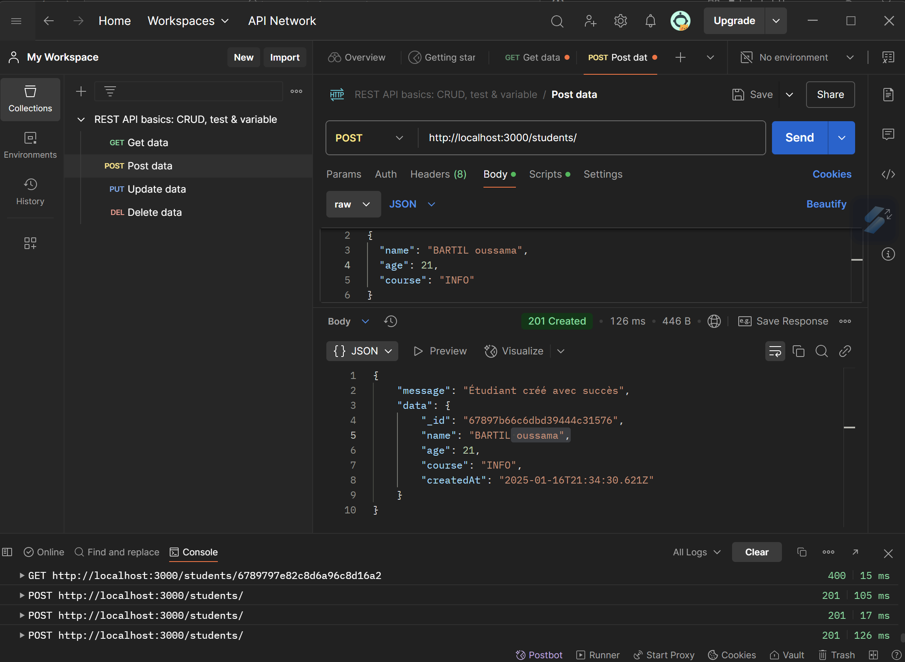
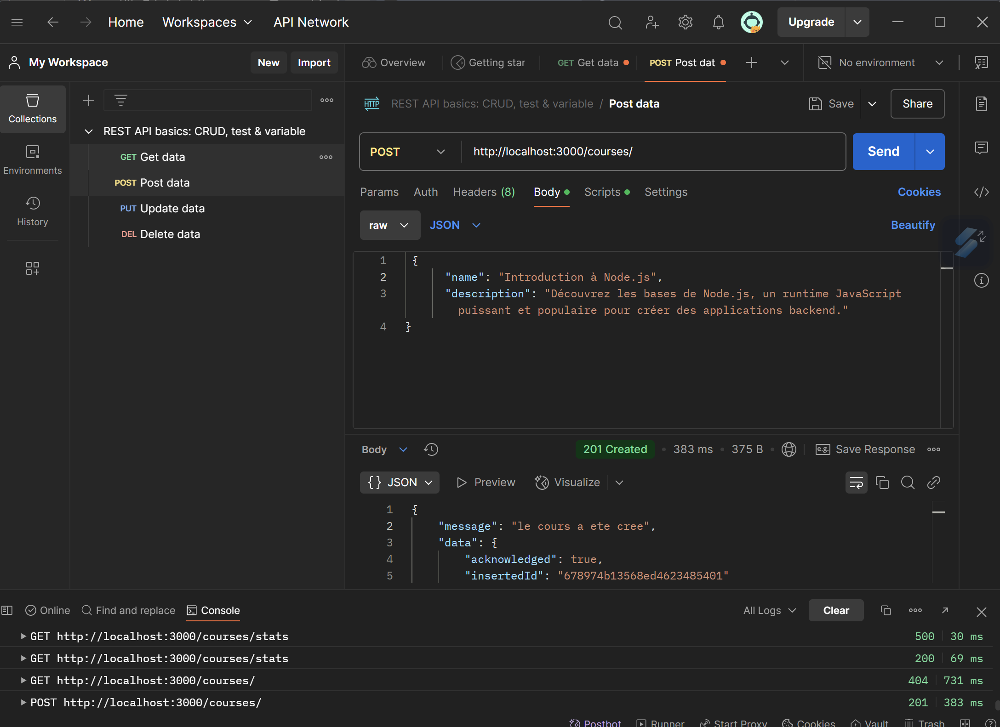
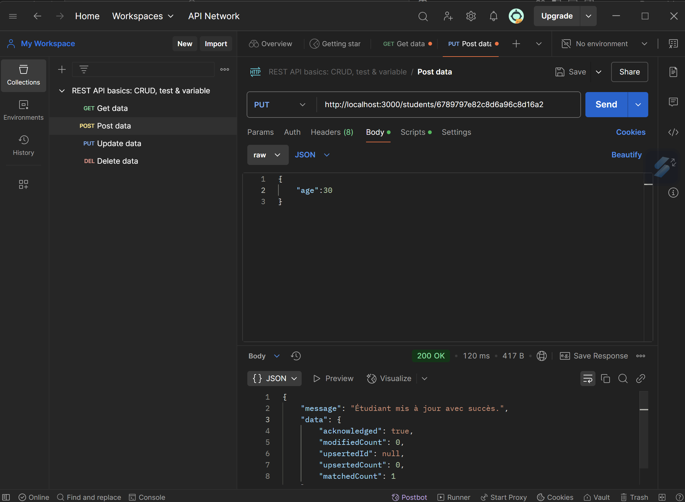
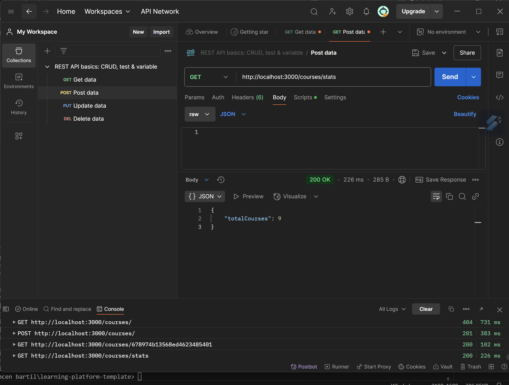
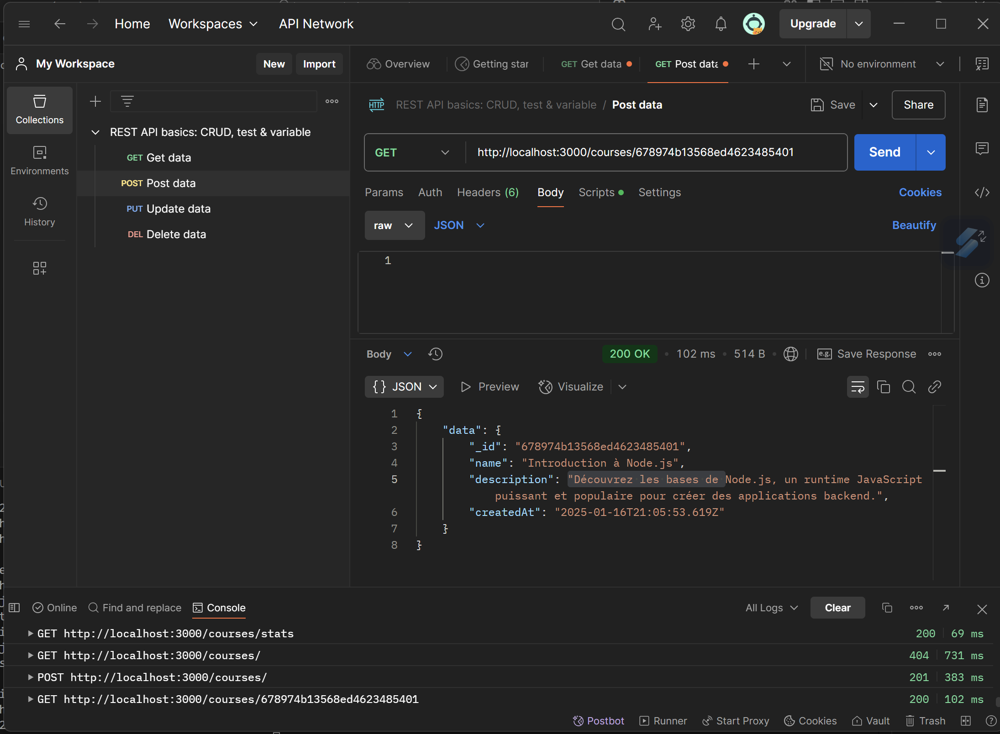
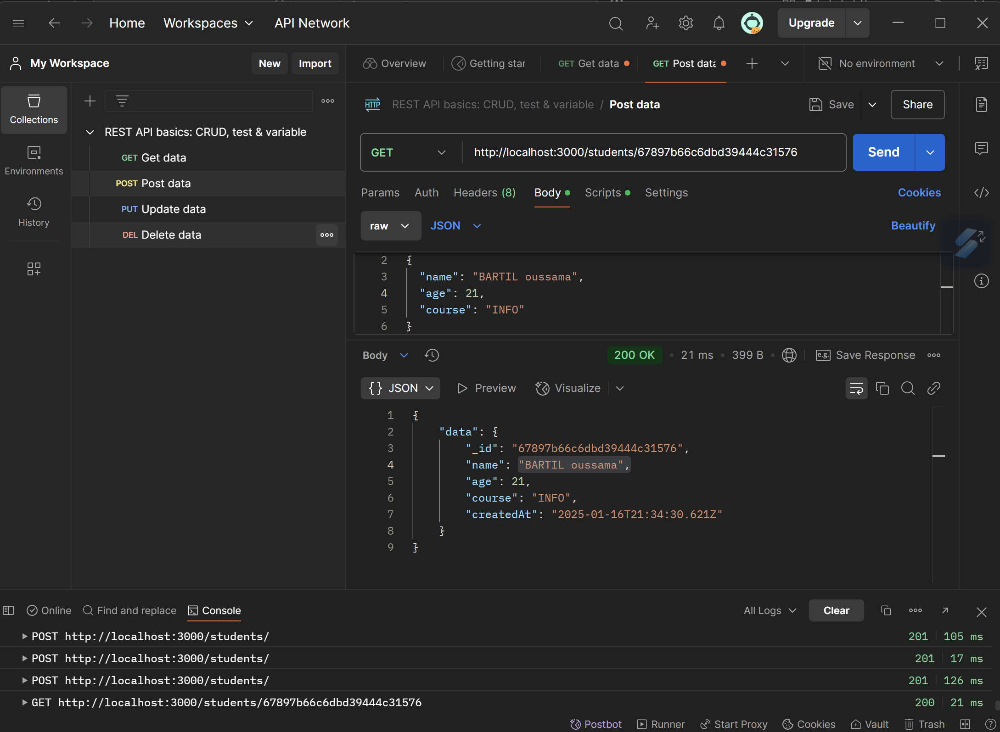
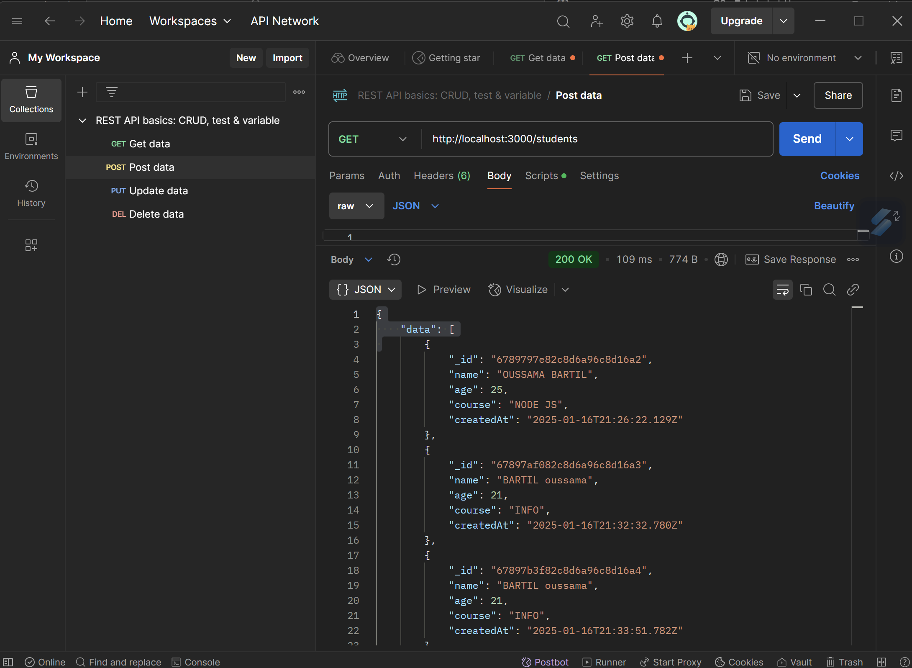
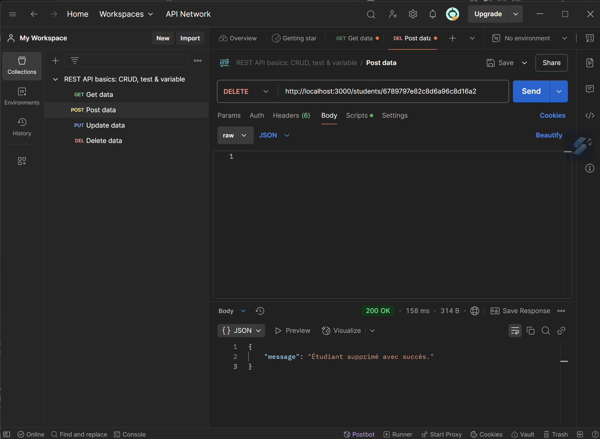

# Learning Platform NoSQL

## Description

Ce projet est une API backend pour une plateforme d'apprentissage en ligne, développée en utilisant Node.js, Express, MongoDB et Redis. Il suit les bonnes pratiques de développement pour offrir une structure de code modulaire, performante et facile à maintenir.

---
## Installation et Lancement

### Prérequis

- **Node.js** : Version 14 ou supérieure
- **MongoDB** : Pour le stockage des données
- **Redis** : Pour la gestion du cache

### Étapes d'installation

1. **Clonez le dépôt** :

   ```bash
   git clone https://github.com/oussamabartil/learning-platform-nosql.git
   cd learning-platform-nosql

2. **Installez les dépendances** :
   ```bash
   npm install
3. **Configurez les variables d'environnement** :
Créez un fichier .env à la racine du projet avec les paramètres suivants :
      ```bash
      MONGODB_URI=mongodb://localhost:27017
      MONGODB_DB_NAME=learning_platform
      REDIS_URI=redis://localhost:6379
      PORT=3000
4.  **Démarrez MongoDB et Redis** :
      ```bash
      sudo systemctl start mongod
      sudo systemctl start redis-server

5. **Lancez l'application** :
   ```bash
   npm start

## Structure du Projet
Voici la structure du code avec une description de chaque dossier et fichier :

         
         ```bash
         ├── src
         │   ├── config
         │   │   ├── db.js # Connexions aux bases de données
         │   │   ├── env.js # Validation des variables d'environnement
         │   ├── controllers
         │   │   ├── courseController.js # Logique métier des cours
         │   │   ├── studentController.js # Logique métier des étudiants
         │   ├── routes
         │   │   ├── courseRoutes.js # Routes liées aux cours
         │   │   ├── studentRoutes.js # Routes liées aux étudiants
         │   ├── services
         │   │   ├── mongoService.js # Services MongoDB
         │   │   ├── redisService.js # Services Redis
         │   ├── app.js # Point d'entrée de l'application
         ├── .env # Fichier de configuration des variables d'environnement
         ├── .gitignore # Fichiers/dossiers à ignorer par Git
         ├── package.json # Dépendances et scripts du projet
         └── README.md # Documentation du projet


## Choix Techniques

- **Node.js et Express** : Création d'une API RESTful performante.
- **MongoDB** : Gestion des données non relationnelles.
- **Redis** : Cache pour améliorer les performances.
- **dotenv** : Gestion des variables d'environnement.

## Réponses aux Questions du Projet

### Pourquoi créer un module séparé pour les connexions aux bases de données ?
Afin d'isoler la logique de connexion et aussi de partager la meme connection dans toute application (facilite aussi reutilisabilite et mantenabilite de code )

###  Comment gérer proprement la fermeture des connexions ?
Avant arret de application il faut qu'uo appel la methodes de fermeture de connection comme mongoClient.close(),redisClient.close()... 

### Pourquoi est-il important de valider les variables d'environnement au démarrage ?
Pour detecter les erreurs de configuration au moment de demarage et eviter les comportomants inattendus en production


### Que se passe-t-il si une variable requise est manquante ?
L'application ne pourra pas fonctionner correctement, elle va etre arreter ou application va declencher un erreur.


### Quelle est la différence entre un contrôleur et une route ?
la route definit URL et la methode HTTP mais le controlleur il gere la logique  metier ,service (se qui concerne le traitement , validation..)avant de renvoyer la reponse.

### Pourquoi séparer la logique métier des routes ?
Afin de separer la couche metier et pour rendre aussi le code lisible facile a reutiliser et facile a maintenaire.

### Pourquoi séparer les routes dans différents fichiers ?
Afin d'organiser et isoller les routes des utilisateurs de differents  parties de l'application

### Comment organiser les routes de manière cohérente ?
Pour organiser les routes il faut les separer selon les ressources par exemple ici les routes de courses aussi en utilisant Http action Soit GET,POST,PUT,DELETE...

### Pourquoi créer des services séparés ?
Pour regrouper la logique d’accès aux données (CRUD) ou traitement complexe dans un endroit central, réutilisable par plusieurs contrôleurs.

### Comment gérer efficacement le cache avec Redis ?
En définissant un **TTL (Time To Live)** approprié et en invalidant ou mettant à jour les clés quand les données changent.

### Quelles sont les bonnes pratiques pour les clés Redis ?
Utiliser un préfixe clair (ex : "course:", "user:") et un identifiant unique pour simplifier la gestion et éviter les collisions.

### Comment organiser le point d'entrée de l'application ?
Charger les variables d'env, initialiser les connexions DB, configurer Express et monter les routes.

### Quelle est la meilleure façon de gérer le démarrage de l'application ?
Utiliser une fonction asynchrone pour gérer les erreurs (try/catch),s'assurer que la base est connectée avant d'écouter sur le port.

### Quelles sont les informations sensibles à ne jamais commiter ?
les mots de passe , les url de ma base de donnee ,tokens 

### Pourquoi utiliser des variables d'environnement ?
Afin de separer la configuration du code et evitter de commiter les information sensible c'est pour cela j'ai met le fichier .env dans .gitgnore


## Fonctionnalités principales 

#### 1. Ajouter un étudiant


---

#### 2. Créer un cours


---

#### 3. Modifier les informations d'un étudiant


---

#### 4. Récupérer les statistiques des cours


---

#### 5. Récupérer les informations d'un cours par ID


---

#### 6. Récupérer les informations d'un étudiant par ID


---

#### 7. Récupérer tous les étudiants


---

#### 8. Supprimer un étudiant


#### Ressources

- [Node.js Documentation](https://nodejs.org/en/docs/)
- [Express.js Guide](https://expressjs.com/)
- [MongoDB Documentation](https://www.mongodb.com/docs/)
- [Redis Documentation](https://redis.io/documentation)

## Auteur

Projet développé par **Oussama BARTIL** dans le cadre du projet de fin de module **NoSQL**.


### Réponse des questions des commentaires
##### Question : #####

### Réponse : ###

##### Question : #####
### Réponse : ### 

